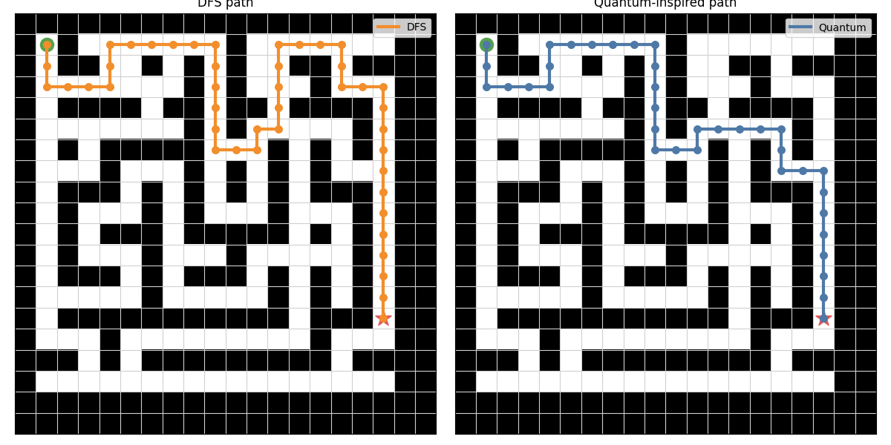
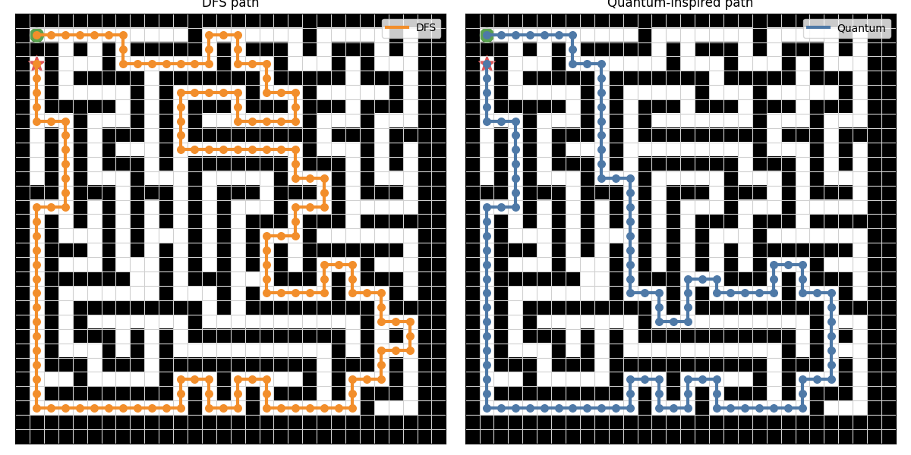
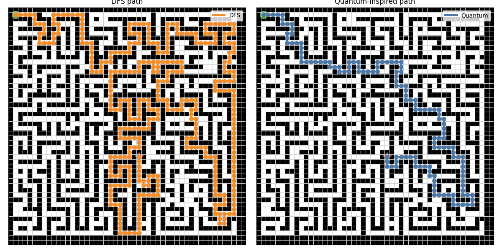
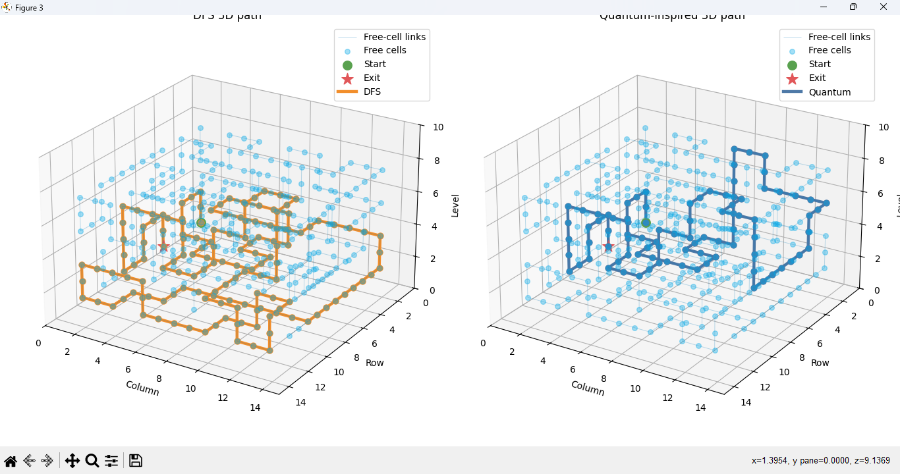
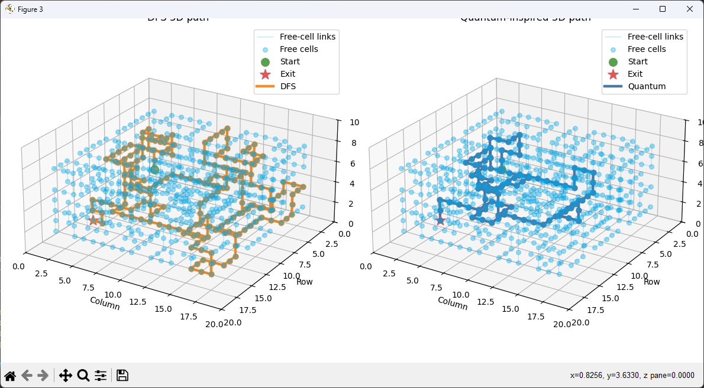
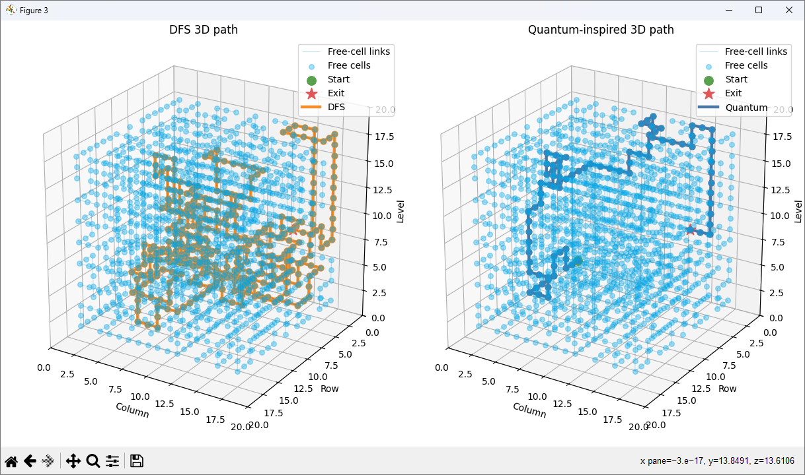

# Classical DFS Agent vs Quantum-Inspired Parallel Search Agent

## Goal

This project compares two maze-solving strategies on the same 2D grid maze:

- a classical depth-first search agent
- a quantum-inspired parallel branch exploration agent

The goal is to make the behavioral difference visible and measurable. DFS commits to one route and backtracks when needed, while the quantum-inspired agent keeps many possible routes active at the same time.

## Maze Representation

The maze is represented as a 2D grid:

- `0`: free cell
- `1`: wall
- `"S"`: start cell
- `"E"`: exit cell

By default, the project generates a new random 2D maze on each run. The generated maze includes walls, crossroads, dead ends, and exactly one valid exit. A fixed sample maze is also available with `--sample`.

The project also supports 3D mazes. In 3D mode, positions are represented as:

```text
(level, row, col)
```

The agents can move in six directions: up, down, left, right, one level above, and one level below.

## Classical DFS Agent

The classical DFS agent follows one path as deeply as possible before trying alternatives.

At each crossroad, it stores unexplored alternatives in a stack. If the current path reaches a dead end, the agent pops the most recent saved state from the stack and continues searching from there. This models a traditional depth-first traversal with stack-based backtracking.

DFS is memory-efficient because it usually keeps only a limited stack of alternatives, but it may find a longer path if it explores an unlucky branch first.

## Quantum-Inspired Parallel Search Agent

The quantum-inspired agent simulates parallel branch exploration.

It maintains a list of active paths. In each iteration, every currently active path expands by one step. If any expanded path reaches the exit, the search stops and returns that path.

Because it expands paths level by level, it can find a shortest path in an unweighted maze. It may use more memory than DFS because it keeps multiple active paths at once.

## Not Real Quantum Computing

This project does not perform real quantum computing.

The quantum-inspired agent is a classical simulation inspired by the idea of exploring many branches in parallel. It does not use qubits, superposition, interference, quantum gates, Qiskit, or a quantum backend.

## Installation

Use Python 3.11 or newer.

Install dependencies:

```bash
python -m pip install -r requirements.txt
```

The only runtime external dependency is `matplotlib`.

For development and pytest support, install:

```bash
python -m pip install -r requirements-dev.txt
```

## Running the Project

From the project root, run:

```bash
python main.py
```

This generates a new random 2D maze, prints both agents' final paths, their metrics, a comparison table, and then opens matplotlib visualizations.

Choose 2D explicitly:

```bash
python main.py --dimension 2d
```

Run a 3D maze:

```bash
python main.py --dimension 3d --width 9 --height 9 --depth 5
```

Open the 3D plot in a native interactive matplotlib window:

```bash
python main.py --dimension 3d --width 9 --height 9 --depth 5 --interactive-3d
```

In the interactive 3D window, use the mouse to rotate the plot and the matplotlib toolbar or mouse wheel for pan and zoom.

Run without opening plots:

```bash
python main.py --no-show
```

Use the fixed demo maze:

```bash
python main.py --sample
```

Use the fixed 3D demo maze:

```bash
python main.py --dimension 3d --sample
```

Control the random maze size and complexity:

```bash
python main.py --width 21 --height 21 --complexity 0.9 --loop-factor 0.05
```

Control the 3D maze size:

```bash
python main.py --dimension 3d --width 11 --height 11 --depth 7 --complexity 0.85
```

Use a seed when you want the same random maze again:

```bash
python main.py --width 21 --height 21 --complexity 0.9 --seed 42
```

Random maze options:

- `--width`: maze width, minimum `5`
- `--height`: maze height, minimum `5`
- `--depth`: number of 3D levels, minimum `3`; used only with `--dimension 3d`
- `--complexity`: value from `0.0` to `1.0`; higher means more walls and dead ends
- `--loop-factor`: value from `0.0` to `1.0`; higher opens more alternate routes
- `--seed`: optional integer for reproducible maze generation

For large 3D mazes, start with a low `--loop-factor`. The quantum-inspired agent keeps many active paths, so 3D mazes with many loops can become expensive quickly.

3D visualization options:

- `--interactive-3d`: tries to open a native matplotlib window for rotate, pan, and zoom
- `--hide-3d-free-cells`: hides the translucent free-cell volume if the plot is too busy
- `--hide-3d-free-cell-links`: hides the thin lines connecting neighboring free cells
- `--show-3d-walls`: shows 3D wall markers; they are hidden by default so the walkable space and final paths stay clear

If PyCharm still shows a static image instead of an interactive window, disable:

```text
Settings -> Tools -> Python Scientific -> Show plots in tool window
```

Also show visited-order visualizations:

```bash
python main.py --show-visited-order
```

Run with a custom text maze:

```bash
python main.py --maze-file path/to/maze.txt
```

Custom text maze files currently support 2D mazes only.

Supported custom maze characters:

- `0`, `.`, or space: free cell
- `1` or `#`: wall
- `S`: start
- `E`: exit

## Metrics Compared

The project compares:

- `found`: whether the exit was reached
- `path_length`: number of moves from `S` to `E`
- `explored_nodes`: number of unique cells explored
- `execution_time`: runtime in seconds or milliseconds
- memory proxy:
  - DFS: `max_stack_size`
  - Quantum-inspired: `max_active_paths`

DFS also tracks:

- `total_steps`
- `dead_ends`

The quantum-inspired agent also tracks:

- `total_parallel_iterations`

The same metrics are used for both 2D and 3D runs.

## Visualization

The project uses matplotlib for both 2D and 3D plots.

In 2D mode:

- walls are black cells
- free cells are white cells
- start is green
- exit is red
- each final path is overlaid on the maze

In 3D mode:

- walkable/free cells are shown as translucent cyan circular 3D markers
- neighboring walkable/free cells are connected with thin translucent blue lines
- wall markers are hidden by default
- start is green
- exit is red
- each final path is drawn as a 3D line
- DFS and quantum-inspired paths can be compared side by side

If you want to inspect the walls during debugging, show them explicitly:

```bash
python main.py --dimension 3d --interactive-3d --show-3d-walls
```

## Visual Results and Benchmark Snapshots

The following plots were generated from random mazes and saved in the `plots/` directory. They show the final DFS path on the left and the quantum-inspired path on the right.

Because these runs used `seed=random`, the exact maze, paths, and timings will vary on future executions unless a fixed `--seed` value is provided. The numbers below are snapshots from completed local runs, not universal performance guarantees.

### 2D Snapshots

#### 20x20 Maze, Complexity 0.7



```bash
python main.py --width 20 --height 20 --complexity 0.7
```

| Metric | DFS | Quantum-inspired |
|---|---:|---:|
| Found | yes | yes |
| Path length | 43 | 35 |
| Explored nodes | 46 | 171 |
| Execution time | 0.257 ms | 10.164 ms |
| Memory proxy | max_stack_size=14 | max_active_paths=274 |
| Extra metric | dead_ends=1 | total_parallel_iterations=35 |

#### 30x30 Maze, Complexity 0.9



```bash
python main.py --width 30 --height 30 --complexity 0.9
```

| Metric | DFS | Quantum-inspired |
|---|---:|---:|
| Found | yes | yes |
| Path length | 150 | 120 |
| Explored nodes | 380 | 397 |
| Execution time | 1.638 ms | 177.654 ms |
| Memory proxy | max_stack_size=15 | max_active_paths=425 |
| Extra metric | dead_ends=25 | total_parallel_iterations=120 |

#### 50x50 Maze, Complexity 0.7



```bash
python main.py --width 50 --height 50 --complexity 0.7
```

| Metric | DFS | Quantum-inspired |
|---|---:|---:|
| Found | yes | yes |
| Path length | 380 | 132 |
| Explored nodes | 621 | 1212 |
| Execution time | 2.991 ms | 128073.791 ms |
| Memory proxy | max_stack_size=48 | max_active_paths=813940 |
| Extra metric | dead_ends=33 | total_parallel_iterations=132 |

The 2D runs show the main trade-off: DFS is usually faster and memory-light, while the quantum-inspired simulation often finds a shorter path by keeping many candidate paths active.

### 3D Interactive Snapshots

In 3D mode, the cyan points and thin blue links show the walkable search space. The orange and blue paths show the DFS and quantum-inspired solutions. Wall markers are hidden by default to keep the volume readable.

#### 15x15x10 3D Maze



```bash
python main.py --dimension 3d --width 15 --height 15 --depth 10 --interactive-3d
```

| Metric | DFS | Quantum-inspired |
|---|---:|---:|
| Found | yes | yes |
| Path length | 273 | 59 |
| Explored nodes | 333 | 408 |
| Execution time | 2.495 ms | 69.144 ms |
| Memory proxy | max_stack_size=28 | max_active_paths=905 |
| Extra metric | dead_ends=17 | total_parallel_iterations=59 |

This run shows the effect of adding vertical movement. DFS follows a long route through the 3D volume, while the quantum-inspired agent reaches the exit with a much shorter path.

#### 20x20x10 3D Maze



```bash
python main.py --dimension 3d --width 20 --height 20 --depth 10 --interactive-3d
```

| Metric | DFS | Quantum-inspired |
|---|---:|---:|
| Found | yes | yes |
| Path length | 208 | 102 |
| Explored nodes | 314 | 675 |
| Execution time | 2.544 ms | 13551.992 ms |
| Memory proxy | max_stack_size=35 | max_active_paths=90235 |
| Extra metric | dead_ends=12 | total_parallel_iterations=102 |

The quantum-inspired method still finds a shorter path, but the number of active paths grows sharply. This is the cost of simulating parallel exploration with ordinary Python data structures.

#### 20x20x20 3D Maze



```bash
python main.py --dimension 3d --width 20 --height 20 --depth 20 --interactive-3d
```

| Metric | DFS | Quantum-inspired |
|---|---:|---:|
| Found | yes | yes |
| Path length | 372 | 86 |
| Explored nodes | 435 | 1513 |
| Execution time | 3.283 ms | 10367.299 ms |
| Memory proxy | max_stack_size=46 | max_active_paths=89357 |
| Extra metric | dead_ends=11 | total_parallel_iterations=86 |

This deeper 3D maze makes the contrast especially visible: the shortest-style parallel expansion finds a compact route, but its memory proxy becomes much larger than the DFS stack.

#### Large 50x50x4 3D Run

```bash
python main.py --dimension 3d --width 50 --height 50 --depth 4 --interactive-3d
```

| Metric | DFS | Quantum-inspired |
|---|---:|---:|
| Found | yes | yes |
| Path length | 332 | 202 |
| Explored nodes | 371 | 1171 |
| Execution time | 5.960 ms | 2075.903 ms |
| Memory proxy | max_stack_size=25 | max_active_paths=2995 |
| Extra metric | dead_ends=10 | total_parallel_iterations=202 |

For larger 3D mazes, the quantum-inspired simulation can become expensive very quickly. If a run becomes too heavy, reduce `--width`, `--height`, `--depth`, or `--loop-factor`, or use `--no-show` while collecting metrics.

## Example Terminal Output

For large mazes, the full final path can be very long. The project prints the complete path in the terminal, but this README focuses on the summary table:

```text
Comparison
----------
Metric               DFS                Quantum-inspired
-------------------  -----------------  --------------------
Found                yes                yes
Path length          150                120
Explored nodes       380                397
Execution time (ms)  1.638              177.654
Memory proxy         max_stack_size=15  max_active_paths=425
```

## Tests

Run the test suite:

```bash
python -m unittest discover -s maze_agents/tests
```

Or run the same tests with pytest:

```bash
python -m pytest
```

## Future Extensions

Possible next steps:

- Add Qiskit experiments that encode small maze states into quantum circuits.
- Explore Grover-style search for finding marked exit states.
- Model maze traversal with discrete-time or continuous-time quantum walks.
- Compare classical BFS, A*, Dijkstra, and heuristic agents against the current agents.
- Add randomized maze generation and benchmark results across many maze shapes.
- Export animations showing DFS backtracking and parallel path expansion over time.
